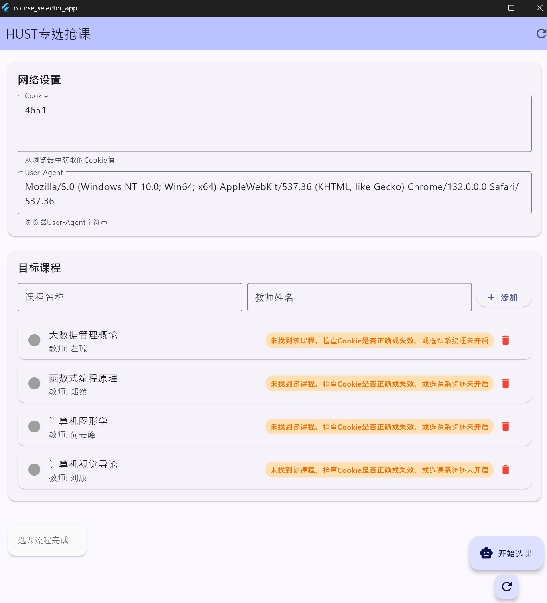
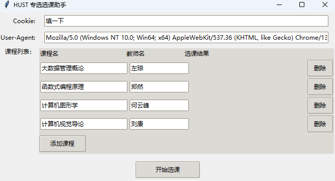
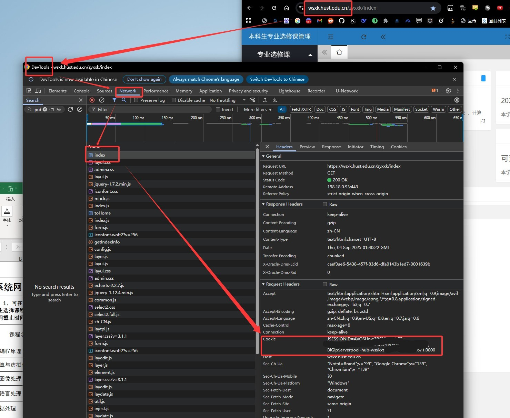
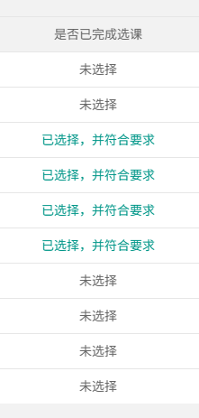
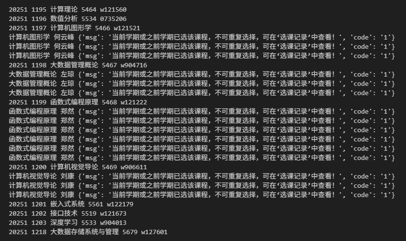

### 此脚本仅供交流学习使用！

---

# HUST Major Course Select

---

~~华科主菜选择❌~~

~~我要打华科Major❌~~

**华科专选抢课直达脚本✔️**

---

GUI新版本[已发布](https://github.com/potatoshred/HUST_Major_Course_Select_GUI/releases/latest)，可直接用。

# 以下为旧版本

---

## 使用方法

1. 配置python3环境，并 `pip install requests`
2. 下载[本脚本](./selectMajor.py)，手动配置**Cookie**和**待选课程**，User-agent一般**不需要**修改.
3. 待选课系统打开后，运行 `python selectMajor.py`

## Cookie查找方法

## 效果

