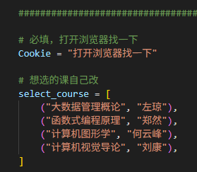

### 此脚本仅供交流学习使用！

---

# HUST Major Course Select

---

~~华科主菜选择❌~~

~~我要打华科Major❌~~

**华科专选抢课直达脚本✔️**

---

## 使用方法

1. 配置python3环境，并 `pip install requests`
2. 下载[本脚本](./selectMajor.py)，用编辑器打开，手动配置Cookie和待选课程

   
3. 待选课系统打开后，运行 `python selectMajor.py`

## Cookie查找方法

## 效果

